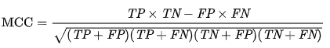

This notebook explores dplyr data wrangling with a phishing data set from the [UCI repository](https://archive.ics.uci.edu/ml/datasets/Phishing+Websites#
)

The data was converted from Weka format to an R data frame using this code:

```{r}
library(RWeka)
df <- read.arff("Training Dataset.arff")
```

Now using tbl_df(), convert the dataframe to a tibble. Examine the tibble with glimpse. Notice that all columns are factors. Many have two levels: 1 and -1, some have a 3rd level of 0. The documentation in the UCI ML link explains each column.

```{r, warning=FALSE}
library(tidyverse)
tb <- tbl_df(df)
glimpse(tb)
```

Using a ggplot bar plot shows that the target column Result is failry evenly balanced.

```{r}
ggplot(tb, aes(x=Result)) + geom_bar(fill="cornflowerblue")
```
### Train Test Split

A different way to split data. First create a row ID for each row, then sample 75% into train using sample_frac(), and put the rest in test using anti_join().

```{r}
tb <- tb %>% mutate(id=row_number())
set.seed(1234)
train <- tb %>% sample_frac(.75)
test <- anti_join(tb, train, by='id')
```


### Logistic regression on all predictors

The test accuracy is .93 using all 31 predictors. The mcc scores is .87. MCC returns a value between -1 and +1. The formula is:


MCC, or Matthews correlation coefficient, is used for binary classification. Some people like mcc because it will produce a high score only if all 4 categories TP, TN, FP, FN are good, and it's proportional to the number of true/false observations.

```{r}
library(mltools)
glm1 <- glm(Result~.-id, data=train, family=binomial)
probs <- predict(glm1, newdata=test, type="response")
pred <- ifelse(probs>0.5, 2, 1)
acc1 <- mean(pred==as.integer(test$Result))
mcc1 <- mcc(pred, as.integer(test$Result))
```

## Finding a simpler model

The model seems to be good but is hard to interpret with so many predictors. Let's search for a simpler model by first eliminating coefficients with low p-values. Extracting the p-values from summary() gives a named vector. This is subset to only those with p-values > .05

These columns will be removed.

```{r}
temp <- summary(glm1)$coefficients[,4]  # extract all 39 p-values
temp <- temp[temp>0.05]
temp
```

Next we use stringr's str_extract() and str_remove() functions to get rid of the dummy endings.

```{r}
delete_cols <- names(temp) %>% str_extract("\\w+") %>%
  str_remove_all("\\d$")
delete_cols
```

Remove columns with high p-values

```{r}
tb_reduced <- tb %>% select(-one_of(delete_cols)) 
glimpse(tb_reduced)
```
```{r}
train2 <- tb_reduced %>% sample_frac(.75)
test2 <- anti_join(tb_reduced, train2, by='id')
```


### Run logistic regression on the reduced data set

The logistic regression model on the reduced data set is slightly less accurate but more interpretable with only 16 predictors. 

```{r}
glm2 <- glm(Result~.-id, data=train2, family=binomial)
probs <- predict(glm2, newdata=test2, type="response")
pred <- ifelse(probs>0.5, 2, 1)
acc2 <- mean(pred==as.integer(test2$Result))
mcc2 <- mcc(pred, as.integer(test2$Result))
summary(glm2)
```

### Group Features by Type

The documentation at the link above grouped the features into 4 general categories:

* address bar features
* abnormal based features
* html and JavaScript features
* domain based features

Looking at a few of the features in the domain based category does not show any strong relationship between the 2 or 3 levels of the feature and the target. Most of these got low p-values in the summary() done at the console, but their coefficients are small, indicating a minimal contribution to the log odds. 

```{r}
library(gridExtra)
p1 <- ggplot(tb_reduced, aes(x=web_traffic, fill=Result)) + geom_bar()
p2 <- ggplot(tb_reduced, aes(x=DNSRecord, fill=Result)) + geom_bar()
p3 <- ggplot(tb_reduced, aes(x=Links_pointing_to_page, fill=Result)) + geom_bar()
grid.arrange(p1, p2, p3, nrow=1)
```


Two predictors with larger coefficients for the dummy factors include SSLfinal_State (looks for suspicious htyps protocols) and URL_of_Anchor (looks for funny things in <a> tags). We can see the same thing in the graph:

* SSLfinal_State=1 has most of the observations as Result=1, most for levels 0 and -1 most of the observations have Result=-1
* URL_of_Anchor levels 0 and 1 have most observations as Result=1 while level -1 has almost all observations a Result=-1

This is an indication that there is predictive power in some of these levels. 

```{r}
p1 <- ggplot(tb_reduced, aes(x=SSLfinal_State, fill=Result)) + geom_bar()
p2 <- ggplot(tb_reduced, aes(x=URL_of_Anchor, fill=Result)) + geom_bar()
grid.arrange(p1, p2, nrow=1)

```


### mutate and replace

The next code uses mutate and replace to:

* Make SSL final state binary by making 0 and -1 zero
* Make URL_of_Anchor binary by making 0 and 1 one and -1 zero (0 becomes 1 and -1 becomes 0)


```{r}
tb3 <- mutate(tb_reduced, SSLfinal_State = replace(SSLfinal_State, which(SSLfinal_State == -1), 0))

tb3 <- mutate(tb3, URL_of_Anchor = replace(URL_of_Anchor, which(URL_of_Anchor==0), 1))
tb3 <- mutate(tb3, URL_of_Anchor = replace(URL_of_Anchor, which(URL_of_Anchor==-1), 0))

```

### Another model

A third logistic regression model is used, this time only use the two variable that were just mutated. The accuracy is lower than either model, but is much more interpretable as you can see in the summary.


```{r}
train3 <- tb3 %>% sample_frac(.75)
test3 <- anti_join(tb3, train3, by='id')

glm3 <- glm(Result~SSLfinal_State+URL_of_Anchor, data=train3, family=binomial)
probs <- predict(glm3, newdata=test3, type="response")
pred <- ifelse(probs>0.5, 2, 1)
acc3 <- mean(pred==as.integer(test3$Result))
mcc3 <- mcc(pred, as.integer(test3$Result))
summary(glm3)
```

